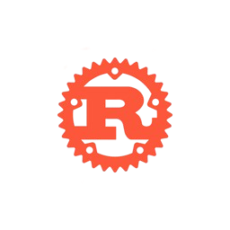

<h1 align="center">Hi there 👋, I'm [Ton Prénom]</h1>

### 👨‍💻 About Me

I'm a Junior Full Stack Developer currently learning at **01Edu**.  
I specialize in building secure, efficient, and scalable applications with a strong focus on **cybersecurity**, **mobile development**, and **DevOps** practices.

🎓 Completed full curricula in **Go**, **JavaScript**, **Rust**, **Next.js**, and **PHP**.  
📱 Hands-on experience with **Flutter** and **Java**.  
🔐 Passionate about **ethical hacking**, **OSINT**, and **digital forensics**.  
⚙️ Exploring **DevOps** tools and practices to streamline development workflows.

---

## Languages and Tools 

### Languages:
| Rust | C | JS | C++ | GO | Java |
|----------|----------|----------|-----|-----|-----|
|   |   |   |  |  |  | 

### My tools for Data Manipulation & Visualisation:

| MySQL | SQLite |
|-------|--------|
|| |

  
### Environments, Testing, Other:

| nodejs | Git | Docker | Vmware | VBox | Postman |
|--------|-----|--------|--------|------|---------|
|||||  |  |

### OS:

| Kali | Parrot | Windows |
|----------|----------|----------|
|  |  |  

---

### 🔧 Current Projects

- **Passive Recon Tool:** Extracts public data like names, IPs, addresses, and social profiles.  
- **Inspector Image:** Analyzes image metadata and hidden content (e.g., PGP keys).

---

### 📊 GitHub Stats

  
   
  
   
  

---

### 🐍 Contribution Snake

 

---

### 📫 Let's Connect

Feel free to reach out or check out my latest work:

- GitHub: [github.com/TonNomUtilisateurGitHub](https://github.com/D4wn-Light)
- LinkedIn: [linkedin.com/in/TonNom](https://linkedin.com/in/el-hadj-sadou-barry)

---

> "Learning by doing, breaking to understand."
